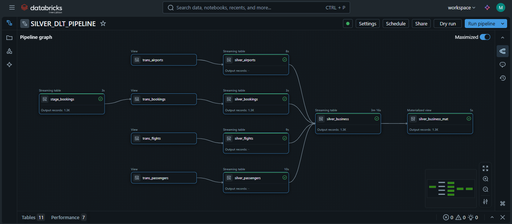

# Databricks Airline Booking Pipeline Project

## Overview
This project is an end-to-end Data Engineering pipeline built using Databricks, Spark Structured Streaming, Delta Lake, Lakeflow Declarative Pipelines (Delta Live Tables), and DBT.

It simulates a real-world airline booking dataset with incremental data ingestion, data transformations, and a dimensional data model, following the Medallion architecture (Bronze, Silver, Gold layers).

The pipeline is production-ready, demonstrating modern data engineering practices:
- Dynamic and reusable notebooks
- Slowly Changing Dimensions (SCD) Type 1
- Fact and dimension table builders
- Integration with Databricks SQL endpoints for analytics
- DBT for modular, version-controlled SQL transformations

## Project Structure

The project is organized into folders based on the **Medallion architecture**:

Bronze Layer:
- BronzeLayer.ipynb
- srcParameters.ipynb

Silver Layer:
- dltPipeline.py (Lakeflow DLT pipeline)

Gold Layer:
- GOLD_DIMS.ipynb
- GOLD_FACT.ipynb

Other files:
- `README.md` — Project overview

## Features

- Incremental Data Ingestion: Databricks Autoloader + Spark Structured Streaming.
- Silver Layer Transformations: Data cleansing and enrichment using Lakeflow Declarative Pipelines with built-in data quality checks.
- Gold Layer Dimensional Modeling: Dynamic SCD builder and fact table builder for a star schema.
- DBT Integration: Modular, version-controlled SQL transformations running on Databricks.
- Production-ready Pipelines: Parameterized, reusable notebooks for multiple datasets and dynamic workflows.
- BI-ready Outputs: Gold layer tables exposed through Databricks SQL endpoints for downstream analytics.

## Technologies Used

- Databricks Free Edition (Unity Catalog, Serverless SQL Warehouses)
- Spark Structured Streaming
- Delta Lake
- Lakeflow Declarative Pipelines (Delta Live Tables)
- Python and PySpark
- DBT (Data Build Tool)
- Git & GitHub for version control

## Screenshots

**Bronze Layer: Bronze Ingestion Job**  
  

**Silver Layer: Silver DLT Pipeline**  
  

